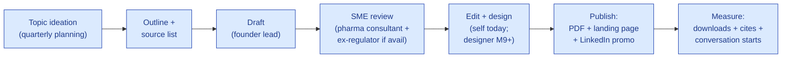

# Research Index

| Field | Value |
|---|---|
| Owner | Founders + Marketing |
| Status | v1.0 |
| Last updated | 2026-05-31 |

---

## 1. Research portfolio

```mermaid
flowchart TB
    classDef live fill:#dcfce7,stroke:#15803d,color:#14532d
    classDef plan fill:#fef3c7,stroke:#92400e,color:#78350f

    A["✅ Per-sector market analysis (8 pages, 2026)"]:::live
    B["✅ EQMS supplier-audit industry study (8 pages, 2026)"]:::live
    C["✅ Quality software research paper (4 pages, 2026)"]:::live
    D["⏳ AI in regulated industries whitepaper"]:::plan
    E["⏳ EQMS landscape 2027 (annual)"]:::plan
    F["⏳ Standards convergence (post ISO 9001:2026)"]:::plan
    G["⏳ Customer case studies (post-first-3)"]:::plan
```

## 2. Live research papers

| Title | Pages | Audience | Source |
|---|---|---|---|
| **Per-sector market analysis: the industry-agnostic compliance engine** | 8 | Investors, partners, prospects | `00-strategy-and-pitch/market-and-strategy/per-sector-market-analysis.pdf` (legacy) |
| **EQMS + supplier-audit industry study** | 8 | Investors, technical prospects | `11-research-domain/eqms-supplier-audit-industry-study.pdf` (legacy → import here) |
| **Quality software research paper: 40-year evolution + 6 white spaces** | 4 | Industry observers, analysts | `11-research-domain/quality-software-research-paper.pdf` (legacy → import here) |

## 3. Research themes (the publication agenda)

| Theme | Why it matters | Cadence |
|---|---|---|
| **Sector expansion mapping** | Validates the industry-agnostic engine thesis ring by ring | 1-2/yr |
| **Standards convergence** (ISO 9001:2026, IA9100, IATF) | Hawkeye is rowing with this current; explain it publicly | 1/yr |
| **AI in regulated industries** | Stake the "grounded + reproducible" position; counter "AI black box" criticism | Quarterly |
| **Customer case studies** | Real ROI numbers > generic claims | Per-customer |
| **Regulatory deep-dives** (per standard) | Establish technical credibility | 1-2/quarter |

## 4. Research production workflow

## 5. Research → sales feedback loop

| Research output | Sales use |
|---|---|
| Per-sector market analysis | Investor pitch ("industry-agnostic engine thesis") + prospect tailoring (sector-specific section) |
| EQMS landscape paper | Bake-off positioning vs Veeva/MasterControl |
| AI grounding whitepaper | Differentiator in technical demos |
| Customer case studies | ROI proof in discovery calls + reference calls |
| Standards convergence | Future-proofing argument with conservative buyers |

## 6. Source library (for our own research)

Authoritative sources we cite in research:

| Source | Used for |
|---|---|
| Fortune Business Insights, Grand View, Mordor, Fact.MR, Verdantix, Emergen | Market sizing |
| FDA inspection trends + 483 reports | Regulatory enforcement patterns |
| EMA + PIC/S guidance documents | Global pharma regulatory positions |
| ICH Q-series + Annex 11 + Annex 16 | Compliance baselines |
| ISPE GAMP 5 + ISPE PQLI | Validation methodology |
| Customer discovery interview transcripts (anonymized) | Voice-of-customer signal |
| Hawkeye platform telemetry (post-customers) | Anonymized usage trends for industry insights |

## 7. Research distribution channels

| Channel | Format | Cadence |
|---|---|---|
| Hawkeye blog (long-form, hawkeye.io/research) | HTML + PDF download | Per publication |
| LinkedIn company page + founder posts | Summary card + key takeaway | Per publication |
| Industry newsletters (paid sponsorship post-Series A) | Featured article | Quarterly |
| Conference presentations | Live talk + slide deck publication | 2-3/yr |
| Trade press articles (BioPharma Reporter, Pharma IQ, etc.) | Byline article | Opportunistic |
| Analyst briefings (Verdantix, Forrester post-Series A) | Briefing deck | Quarterly post-Series A |

## 8. Roadmap for next 6-12 months

| Quarter | Research planned |
|---|---|
| Q3 2026 | AI grounding whitepaper (4 pages) |
| Q4 2026 | First customer case study (post-first-3 customers) |
| Q1 2027 | EQMS landscape paper 2027 (annual update) |
| Q2 2027 | Standards convergence post ISO 9001:2026 release |
| Q3 2027 | AI in regulated industries — vendor landscape comparison |
| Q4 2027 | Per-sector expansion update (Ring 1 + Ring 2 detail) |

---

## See also

- [PHARMA-DOMAIN-PRIMER.md](../pharma-domain/PHARMA-DOMAIN-PRIMER.md)
- [CONTENT-STRATEGY.md](../../09-sales-marketing/content/CONTENT-STRATEGY.md)
- [MARKET-ANALYSIS.md](../../01-strategy/market-analysis/MARKET-ANALYSIS.md) — the strategic research output
- `backend/docs/11-research/` (legacy) — existing PDFs
