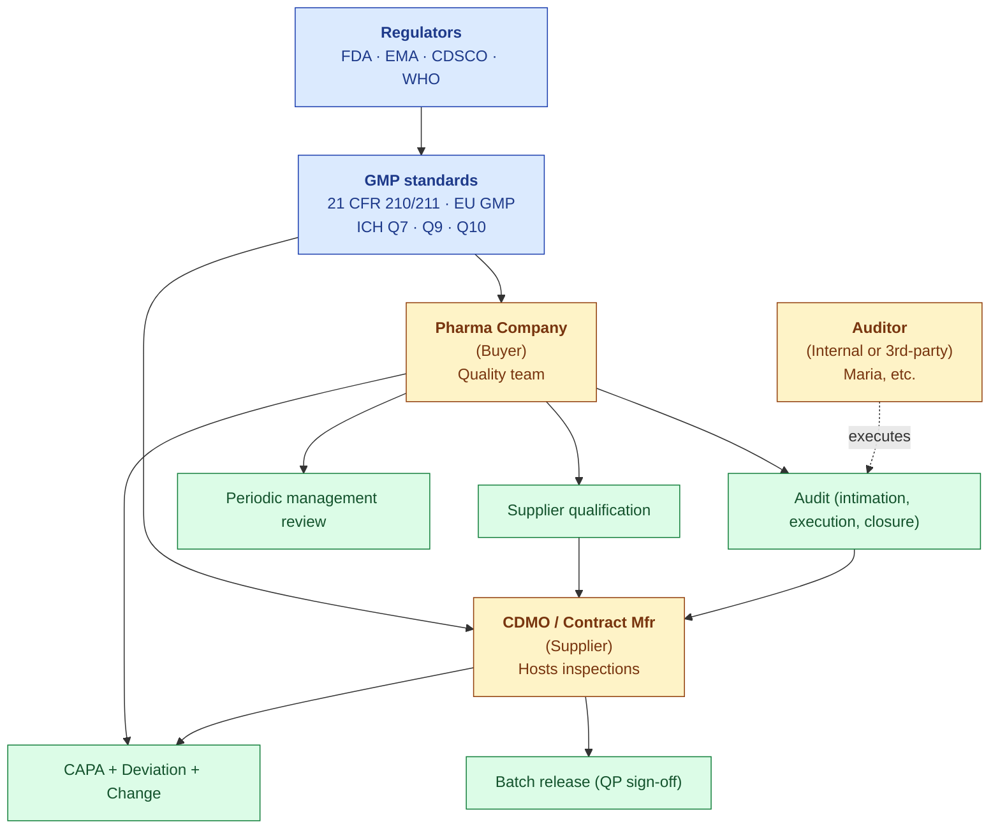

# Pharma Domain Primer

| Field | Value |
|---|---|
| Owner | Founders + Pharma SME |
| Status | v1.0 |
| Last updated | 2026-05-31 |
| Audience | S.M.A.R.T. Hawk staff (engineering, sales, support) onboarding into pharma |

---

## 1. The pharma quality landscape in one diagram

## 2. The pharma supply chain (where audit fits)

| Stakeholder | Role | S.M.A.R.T. Hawk relevance |
|---|---|---|
| **API manufacturer** (e.g., Aurobindo, Lupin) | Makes active ingredients | Supplier (audited by formulators) |
| **Formulator / brand owner** (e.g., Cipla, Sun) | Combines API + excipients into final product | Often the Buyer in audit relationships |
| **CDMO** (Sanpras, etc.) | Contract manufacturer (formulation, packaging) | Supplier (heavily audited; 30+ audits/yr) |
| **Excipient supplier** | Inactive ingredients | Supplier |
| **Packaging supplier** | Primary + secondary packaging | Supplier |
| **Logistics + distribution** | Cold-chain, transport | Supplier |
| **Wholesaler / pharmacy** | End distribution | (Not in S.M.A.R.T. Hawk scope) |

## 3. Key pharma quality processes

### Supplier audit (the wedge)

```mermaid
flowchart LR
    classDef step fill:#dbeafe,stroke:#1e40af,color:#1e3a8a

    A["1. Audit request<br/>(buyer initiates)"]:::step
    B["2. Auditor + supplier<br/>accept"]:::step
    C["3. Intimation letter<br/>(e-signed by supplier)"]:::step
    D["4. PAQ submission<br/>(supplier responds)"]:::step
    E["5. Execution<br/>(onsite/remote audit)"]:::step
    F["6. Findings + observations<br/>(auditor drafts)"]:::step
    G["7. CAPA<br/>(supplier authors)"]:::step
    H["8. Closure certificate<br/>(buyer approves)"]:::step

    A --> B --> C --> D --> E --> F --> G --> H
```

Typical durations:
- Initiation → intimation: 2-4 weeks
- Intimation → onsite audit: 4-12 weeks (notice period required)
- Onsite audit: 1-5 days
- Audit → report: 2-4 weeks
- Report → CAPA closure: 30-90 days
- **Total: 3-6 months per audit**

### CAPA (Corrective + Preventive Action)

| Phase | Owner | What happens |
|---|---|---|
| Intake | QA | Trigger event (deviation, audit finding, complaint) creates CAPA |
| Triage | QA | Classify: No-CAPA / Correction-only / Formal CAPA |
| Investigation | Owner | Determine root cause |
| RCA | Owner | Document why it happened |
| Action plan | Owner | What we'll do about it (corrective + preventive) |
| Execution | Owner | Implement actions |
| Effectiveness check | QA | Verify the actions worked (typically 90-180 days post-implementation) |
| Closure | QA | Formal close after effectiveness verified |

### Deviation

A deviation is **any departure from approved procedures/specs**. Pharma orgs document EVERY deviation, classified by severity:

| Classification | Definition | Action |
|---|---|---|
| Minor | No impact on product quality/safety | Document + correct |
| Major | Potential impact; non-critical | Investigation + CAPA likely |
| Critical | Direct impact on product quality/safety | Investigation mandatory + CAPA + batch hold |

### Change control

ICH Q7 §13 is the most-cited section in audits. A change request goes through:
1. Initiation (with impact statement)
2. Classification (per §13.14: Major / Minor / Routine)
3. Risk assessment (per §13.13)
4. Approval (with e-sig per §13.12)
5. Implementation
6. Post-implementation review (per §13.17)

### Batch release (Annex 16)

The **Qualified Person (QP)** is legally responsible for releasing each batch. Before signing:
- Batch record complete + reviewed
- All deviations investigated + closed
- All CAPAs effective
- All testing complete + within spec
- All change controls applicable to this batch approved

## 4. Key pharma terminology

| Term | Definition |
|---|---|
| **GMP** | Good Manufacturing Practice (the regulatory baseline) |
| **GxP** | Umbrella term: GMP + GLP (lab) + GDP (distribution) + GCP (clinical) |
| **API** | Active Pharmaceutical Ingredient |
| **CDMO** | Contract Development and Manufacturing Organization |
| **CRO** | Contract Research Organization |
| **CMO** | Contract Manufacturing Organization (subset of CDMO) |
| **EQMS** | Electronic Quality Management System (where S.M.A.R.T. Hawk plays) |
| **QMS** | Quality Management System (broader; can be paper) |
| **PQS** | Pharmaceutical Quality System (ICH Q10's term for QMS) |
| **PAQ** | Pre-Audit Questionnaire |
| **QP** | Qualified Person (EU; signs batch release) |
| **GMP audit** | Regulatory inspection by FDA/EMA/etc. |
| **Supplier audit** | Buyer-pharma audits their suppliers (S.M.A.R.T. Hawk's wedge) |
| **Internal audit** | Pharma audits itself (also S.M.A.R.T. Hawk scope) |
| **3rd-party audit** | Independent auditor (e.g., Maria) hired by buyer |
| **Joint audit / shared audit** | Multiple buyers share an audit of one supplier (efficiency play) |
| **Form FDA-483** | Observation report from FDA inspector |
| **Warning Letter** | FDA escalation if 483 not addressed |
| **CSV** | Computer System Validation |
| **IQ/OQ/PQ** | Installation / Operational / Performance Qualification |
| **ALCOA+** | Data integrity principles (Attributable, Legible, Contemporaneous, Original, Accurate, +) |
| **PIC/S** | Pharmaceutical Inspection Co-operation Scheme |
| **WHO-PQ** | WHO Prequalification (for buying into UN supply chains) |
| **MRM** | Management Review Meeting |
| **APR / PQR** | Annual Product Review / Product Quality Review |
| **OOS / OOT** | Out of Specification / Out of Trend |

## 5. The "30 audits a year" problem (why S.M.A.R.T. Hawk exists)

A typical mid-pharma Tier 2/3 supplier hosts ~30+ audits per year:

| Audit type | Frequency | Pain |
|---|---|---|
| Customer audits (one per buyer per year) | 15-30/yr | Each buyer brings their own PAQ format |
| Regulatory inspections (FDA, EMA, CDSCO) | 1-3/yr | High stakes; existential |
| Internal audits | 4-6/yr | Self-assessed |
| Notified Body audits (med-device) | 1-2/yr | EU MDR compliance |
| Certifications (ISO 9001, FSSC) | 1-2/yr | External cert renewal |

> 💡 **Why this is broken today.** Same supplier hosts 30 audits/year. Each buyer wants the same documents in a different format. The QA team spends 60-100 days/year just on audit prep. **S.M.A.R.T. Hawk changes this by providing a single platform where every buyer's audit runs in the same workflow, evidence is reused, and AI drafts the observations.**

## 6. Indian pharma context (S.M.A.R.T. Hawk beachhead)

| Stat | Value |
|---|---|
| Total pharma manufacturing units | ~10,500 |
| WHO-GMP certified for export | ~3,000 |
| Global generic-drug market share | ~20% by volume |
| Top 5 destinations for Indian pharma exports | US, EU, Africa, ASEAN, LATAM |
| US FDA-approved Indian facilities | ~750+ |
| Common standards | WHO-GMP (baseline), US FDA cGMP (for US exports), EU GMP (for EU exports) |

> 💡 **Why India first.** Highest volume of regulated manufacturers + acute audit-redundancy pain + most price-sensitive (Veeva/MasterControl economically inaccessible). Perfect S.M.A.R.T. Hawk beachhead.

## 7. References for deeper learning

- [FDA GMP regulations (21 CFR 210/211)](https://www.accessdata.fda.gov/scripts/cdrh/cfdocs/cfcfr/CFRSearch.cfm?CFRPartFrom=200&CFRPartTo=299)
- [EU GMP Guidelines (EudraLex Volume 4)](https://health.ec.europa.eu/medicinal-products/eudralex/eudralex-volume-4_en)
- [ICH Quality Guidelines](https://www.ich.org/page/quality-guidelines)
- [ISPE Body of Knowledge](https://ispe.org/)
- [PIC/S Inspection Guidance](https://picscheme.org/)
- [PDA (Parenteral Drug Association)](https://www.pda.org/) — practitioner community
- [Indian Pharmacopoeia](https://www.ipc.gov.in/)
- [WHO Technical Report Series](https://www.who.int/publications/i/series)

---

## See also

- [VISION.md](../../01-strategy/vision-and-positioning/VISION.md) — strategic context
- [PERSONAS.md](../../03-product/01-personas-and-research/PERSONAS.md) — who we serve
- [PART-11.md](../../08-compliance-regulatory/frameworks/PART-11.md) — US electronic records
- [EU-GMP.md](../../08-compliance-regulatory/frameworks/EU-GMP.md) — EU
- [ICH-Q-SERIES.md](../../08-compliance-regulatory/frameworks/ICH-Q-SERIES.md) — international standards
