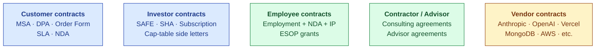
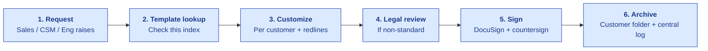

# Contract Index

| Field | Value |
|---|---|
| Owner | CEO + Legal counsel |
| Status | DRAFT v0.1 (scaffold; pre-customer) |
| Last updated | 2026-05-31 |
| Disclaimer | This document is an INDEX of contract types + status; NOT the contracts themselves. Use only with qualified legal counsel. |

---

## 1. Contract families

## 2. Customer contracts

| Contract | Purpose | Template status | Per-customer status |
|---|---|---|---|
| **NDA (mutual)** | Pre-discovery / pre-PoC | ⏳ TBD template | Per-customer at PoC kickoff |
| **MSA (Master Services Agreement)** | Master commercial framework | ⏳ TBD template | Per-customer at signing |
| **DPA (Data Processing Agreement)** | GDPR + DPDPA compliance | ⏳ TBD template | Bundled with MSA for EU/India customers |
| **Order Form** | Subscription specifics (tier, ACV, term, modules) | ⏳ TBD template | Per-customer at signing |
| **SLA (Service Level Agreement)** | Uptime + support commitments | ⏳ TBD template (3 tiers) | Bundled by tier |
| **Acceptable Use Policy** | Customer use restrictions | ⏳ TBD template | Bundled into MSA |
| **Customer DPO contact list** | Contact for data protection escalation | ⏳ TBD | Per-customer |

### Standard MSA clauses (planned)

| Clause | Position | Notes |
|---|---|---|
| Definitions | §1 | Standard |
| Subscription + scope | §2 | References Order Form |
| Fees + invoicing | §3 | Quarterly billing default |
| Customer data + ownership | §4 | Customer owns their data; S.M.A.R.T. Hawk is data processor |
| Confidentiality | §5 | Mutual |
| Intellectual property | §6 | S.M.A.R.T. Hawk owns platform IP; customer owns their content |
| Warranties + disclaimers | §7 | AI-output disclaimer; customer reviews before relying |
| Indemnification | §8 | Mutual; capped at fees paid in prior 12 months |
| Limitation of liability | §9 | Capped at fees paid; consequential damages excluded |
| Term + termination | §10 | 1-year auto-renew; 60-day notice |
| Data export + deletion | §11 | Free export 90 days post-cancellation; per-tenant retention config |
| Governing law + disputes | §12 | India arbitration default; customer-jurisdiction option for Enterprise |
| Force majeure | §13 | Standard |
| Notices | §14 | Standard |

## 3. Investor contracts

| Contract | When | Status |
|---|---|---|
| **Angel SAFE** (preferred at pre-seed) | At angel close | TBD |
| **Angel SHA (Share Subscription Agreement)** | Alternative to SAFE | TBD |
| **Cap-table side letters** | Per-investor | TBD |
| **Investor rights agreement** | At Seed+ | TBD |
| **Right of first refusal + co-sale** | At Seed+ | TBD |
| **Drag-along + tag-along** | At Series A | TBD |

> 💡 **SAFE vs SHA preference at angel.** SAFE is faster + cheaper to close (no equity issuance until conversion). SHA gives investors voting rights immediately. Recommend SAFE for friends-and-family + first angels; SHA for institutional angels who require it.

## 4. Employee contracts

| Contract | When | Status |
|---|---|---|
| **Employment agreement template** | Before first hire | TBD |
| **NDA clause (bundled into employment agreement)** | Always | TBD |
| **IP assignment clause** | Always | TBD |
| **ESOP grant letter template** | At each grant | TBD |
| **Non-compete clause** | Limited (enforced cautiously in India) | TBD |
| **Confidentiality + data-handling acknowledgment** | Bundled into employment agreement | TBD |
| **Exit / offboarding agreement** | At departure | TBD |

### Standard employment agreement clauses

| Clause | Notes |
|---|---|
| Role + duties | Per offer letter |
| Compensation | Salary + variable + ESOP |
| Term | Indefinite (subject to probation) |
| Confidentiality | Survives employment |
| IP assignment | All work-product to company |
| Non-solicit | 12 months post-departure |
| Non-compete | Limited to 6-12 months (India enforceability varies) |
| Termination | Standard notice (typically 1-3 months in India) |
| Governing law | India (Bangalore/relevant jurisdiction) |

## 5. Contractor / Advisor agreements

| Contract | Purpose | Status |
|---|---|---|
| **Pharma SME consulting agreement** | PT advisor for product credibility | TBD |
| **Founding Designer consulting agreement** | PT design work | TBD |
| **Ex-regulator advisor agreement** | Quarterly board-advisory | TBD (post-engagement) |
| **Industry analyst engagement letter** | Briefing + report (post-Series A) | Future |
| **Founder Coach engagement letter** | Quarterly coaching (post-Series A) | Future |

## 6. Vendor contracts

| Vendor | Contract type | Status | Notes |
|---|---|---|---|
| Anthropic | API Terms + DPA | Standard ToS | Multi-LLM gateway abstracts |
| OpenAI | API Terms + DPA | Standard ToS | Same |
| Google (Gemini) | API Terms + DPA | Standard ToS | Same |
| Vercel | ToS + DPA | Pro plan | Standard |
| Render / Railway | ToS + DPA | Standard ToS | Will negotiate at higher tier |
| MongoDB Atlas | MSA + DPA | M10 plan | Standard |
| AWS | Customer Agreement + DPA | Standard | Required for S3 |
| GitHub | Enterprise terms | Org plan | Standard |
| Google Workspace | Enterprise Agreement | Business Starter | Standard |
| Slack | ToS + DPA | Pro plan | Upgrade at scale |
| Zoom / Microsoft Teams | Customer Pay APIs | Customer's own license used | We don't license; we orchestrate via APIs |
| Stripe (when launched) | ToS + payment terms | TBD | Tokenized payments only |

## 7. Contract management process

## 8. Redline policy

| Customer ask | S.M.A.R.T. Hawk position |
|---|---|
| Lower liability cap | Standard cap = 12 months of fees paid. Lower → Founder approval. |
| Customer-jurisdiction governing law | India default; US/EU customer → consider with counsel |
| Indemnification expansion | Standard mutual; expansion = Founder + Legal approval |
| MFN (Most-Favored Nation) clause | Avoid; if Enterprise insists, scope to specific provisions |
| Audit rights | Standard limited; full audit rights = Enterprise tier only |
| Termination for convenience | Standard 60-day notice; mid-term termination = Founder approval |
| Service credit for downtime | Standard SLA credits; expanded = Enterprise |
| Custom feature commitments | Avoid in MSA; capture in separate SOW |
| Data residency in customer jurisdiction | India today; US/EU = future (M18+) |
| BAA (HIPAA) | Not in scope; healthcare customers wait for HIPAA-readiness |

## 9. Contract storage + access

| Document type | Storage | Access |
|---|---|---|
| Active customer contracts | Customer folder + Google Drive | Sales + CSM + Founder |
| Investor contracts | Founder folder | Founders + Counsel |
| Employment contracts | HR folder | Founders + HR (when hired) + employee themselves |
| Vendor contracts | Vendor folder | Founders + Eng leads |
| Templates | Doc_V2/12-legal/templates/ (TBD) | All staff (read-only) |
| Signed copies | DocuSign repository + downloaded backup | Same as above |

## 10. Annual contract audit

Once a year:
- [ ] Review all customer contracts: any expired? Auto-renewed?
- [ ] Vendor contracts: any due for renewal / renegotiation?
- [ ] Employee agreements: any out of date with current law?
- [ ] Templates: do they need refresh per new regulations?
- [ ] Insurance review: cyber liability, D&O, general liability
- [ ] License compliance: open-source dependencies still in good standing?

---

## See also

- [LEGAL-OVERVIEW.md](LEGAL-OVERVIEW.md) — legal posture overview
- [DATA-ROOM.md](../../02-fundraising/data-room/DATA-ROOM.md) — investor-facing
- [CUSTOMER-ACCOUNTS-INDEX.md](../../10-customer-success/customer-accounts/CUSTOMER-ACCOUNTS-INDEX.md) — per-customer contracts
