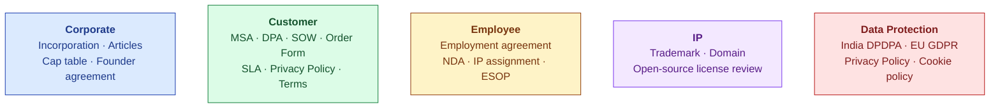

# Legal Overview

| Field | Value |
|---|---|
| Owner | CEO + External legal counsel |
| Status | DRAFT v1.0 (scaffold; pre-customer) |
| Last updated | 2026-05-31 |
| Disclaimer | This document is NOT legal advice. All templates require review by qualified legal counsel in the applicable jurisdiction before use. |

---

## 1. Legal posture

> 💡 **At pre-seed, legal = the minimum set of clean docs that enable angel investment + customer onboarding + employee hiring.** We don't build sophisticated legal frameworks before they're needed. We DO get the foundational docs right because retroactive cleanup is expensive.

## 2. Legal document categories

## 3. Document status

| Document | Status | Priority |
|---|---|---|
| Certificate of incorporation | ⏳ TBD | Must-have for angel close |
| Articles of incorporation / MOA | ⏳ TBD | Must-have for angel close |
| Founders' agreement (50/50 split + vesting + buyout) | ⏳ TBD | Must-have BEFORE angel close |
| Cap table (current) | ⏳ TBD | Must-have |
| ESOP scheme document | ⏳ TBD | Created at angel close |
| Angel investment agreement (SAFE or SHA) | ⏳ TBD | At angel close |
| Customer MSA template | ⏳ TBD | Must-have at first customer |
| Customer DPA (Data Processing Agreement) | ⏳ TBD | Must-have at first customer (esp. EU/India DPDPA) |
| Customer Order Form template | ⏳ TBD | Must-have at first customer |
| SLA template | ⏳ TBD | Per-tier (Starter / Growth / Enterprise) |
| Privacy Policy (web + product) | ⏳ TBD | Must-have at first customer / live web |
| Cookie Policy | ⏳ TBD | Must-have at live web |
| Terms of Service | ⏳ TBD | Must-have at live web |
| Acceptable Use Policy | ⏳ TBD | Bundled into MSA |
| Employment agreement template | ⏳ TBD | Must-have at first hire |
| Employee IP assignment | ⏳ TBD | Bundled into employment agreement |
| Contractor agreement template | ⏳ TBD | Must-have at first contractor |
| Trademark registration | ⏳ TBD | At first significant funding |
| Domain registrations | ✅ hawkeye.io registered | Maintain |
| Open-source license register | ⏳ TBD | Annual review |

## 4. Pre-angel-close checklist

| Item | Status | Owner |
|---|---|---|
| Founders' agreement signed (50/50 + vesting + IP assignment) | ⏳ TBD | Founders |
| Certificate of incorporation | ⏳ TBD | Founders + counsel |
| Articles of incorporation | ⏳ TBD | Founders + counsel |
| Current cap table documented | ⏳ TBD | Founders |
| ESOP scheme drafted (carved at angel close) | ⏳ TBD | Founders + counsel |
| Founders' IP assignment to company | ⏳ TBD | Founders + counsel |
| Angel investment agreement (SAFE preferred at pre-seed) | ⏳ TBD | Founders + counsel + angel's counsel |
| Disclosure schedule (any liabilities, contracts, IP issues) | ⏳ TBD | Founders |

## 5. Pre-first-customer checklist

| Item | Status |
|---|---|
| MSA template (legal-reviewed) | ⏳ TBD |
| DPA template (GDPR + India DPDPA aligned) | ⏳ TBD |
| Order Form template | ⏳ TBD |
| Privacy Policy live on website | ⏳ TBD |
| Terms of Service live on website | ⏳ TBD |
| Acceptable Use Policy bundled | ⏳ TBD |
| SLA template (Starter / Growth / Enterprise tiers) | ⏳ TBD |
| Customer SOC 2 readiness questionnaire response | ⏳ TBD (post-SOC 2 cert) |
| Customer security questionnaire response template | ⏳ TBD |

## 6. Pre-first-employee checklist

| Item | Status |
|---|---|
| Employment agreement template (India) | ⏳ TBD |
| NDA bundled into employment agreement | ⏳ TBD |
| IP assignment clause | ⏳ TBD |
| ESOP grant letter template | ⏳ TBD |
| Contractor agreement template (PT advisors) | ⏳ TBD |
| Indian labor law compliance review | ⏳ TBD |

## 7. Jurisdictional considerations

| Jurisdiction | Why it matters | Action |
|---|---|---|
| **India** | Incorporation + employee location + first customers | Indian counsel; comply with India DPDPA + Companies Act |
| **USA** | Future customers + future incorporation question | When US customers first asked, decide on Delaware C-corp via flip OR US subsidiary |
| **EU** | Future customers; GDPR compliance | GDPR DPA template ready; data residency conversation |
| **UAE / Singapore** | Possible holding structure for tax optimization (post-Series A) | Defer until Series A |

## 8. IP strategy

| IP type | Approach |
|---|---|
| **Trademarks** | Register "S.M.A.R.T. Hawk" in India (filed); USA + EU at first revenue or first angel close (whichever first) |
| **Patents** | Generally not pursuing patent protection (SaaS + AI patents are weak + expensive). Defensive publications instead. |
| **Trade secrets** | Customer corpus + fine-tuned model weights = trade secrets; protected via employee + customer agreements |
| **Copyright** | S.M.A.R.T. Hawk code copyright the company; founders' contributions assigned via founders' agreement |
| **Open source compliance** | Quarterly review of npm dependencies + license categories (MIT/Apache OK; GPL flagged) |

## 9. Data protection compliance

| Regulation | Applies when | Action |
|---|---|---|
| **India DPDPA** | Any Indian customers (always for us) | Privacy Policy + DPA + tenant_admin controls; appoint Data Protection Officer (DPO) at scale |
| **EU GDPR** | Any EU customer (none today; future) | EU DPA template + data residency + DPO requirement at scale |
| **California CCPA/CPRA** | Any CA customer | CCPA disclosures in Privacy Policy |
| **HIPAA (US healthcare)** | Healthcare customers (none today) | BAA template + technical safeguards (not in scope today) |
| **PIPEDA (Canada)** | Canadian customers | Standard practice covers most requirements |
| **LGPD (Brazil)** | Brazilian customers | TBD |

## 10. Risks + open legal questions

| Risk | Mitigation |
|---|---|
| **Customer regulatory liability** (we provide platform; customer is responsible for their compliance use) | MSA explicitly disclaims customer-side regulatory responsibilities; customer's use is at their own risk for regulatory determination |
| **AI output errors causing customer harm** | MSA "Customer is responsible for reviewing AI output before relying on it" clause |
| **Cross-tenant data leak** | Strong tenant isolation in product; insurance (cyber liability) at first customer |
| **IP infringement claim** | LLM provider DPAs cover their outputs; we add indemnification cap |
| **Open source license violation** | Quarterly license review; pre-merge check for GPL dependencies |
| **Employee leaving with customer data** | Employment agreement IP + NDA clauses; offboarding access revocation runbook |
| **Founder dispute / departure** | Founders' agreement covers buyout + vesting + non-compete |

## 11. Legal counsel engagement

| Role | Counsel needed | Cadence |
|---|---|---|
| Corporate (incorporation, cap table, funding) | India SaaS-experienced counsel | At each funding round + ad-hoc |
| Customer commercial (MSA, DPA, SOW) | Same counsel OR commercial specialist | Initial template + per-customer redlines as needed |
| Employment | Indian labor lawyer | Initial template + ad-hoc on edge cases |
| IP (trademark) | IP attorney | Initial filing + maintenance |
| Data protection (DPDPA, GDPR) | Data protection specialist | Initial review + scale event |
| Disputes | Litigation counsel | If needed (unhoped-for) |

> ⚠️ **Pre-seed budget for legal: ~$15-25K/yr.** Most of this is initial template creation. Recurring legal is light if templates are good.

---

## See also

- [CONTRACT-INDEX.md](CONTRACT-INDEX.md) — per-document index
- [DATA-ROOM.md §6](../../02-fundraising/data-room/DATA-ROOM.md#3-tier-1--required-documents-every-investor-asks) — investor-facing legal docs
- [BUSINESS-PLAN.md §9](../../02-fundraising/business-plan/BUSINESS-PLAN.md#9-cap-table--founder-retention-through-series-a) — cap table
- [ORG-OVERVIEW.md](../../00-company/org-chart/ORG-OVERVIEW.md) — employment scope
