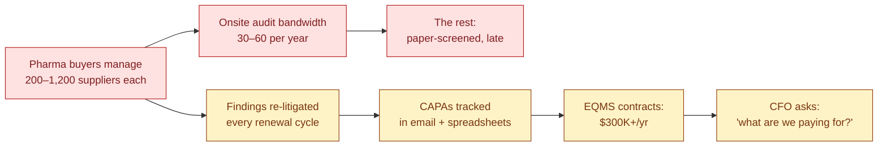
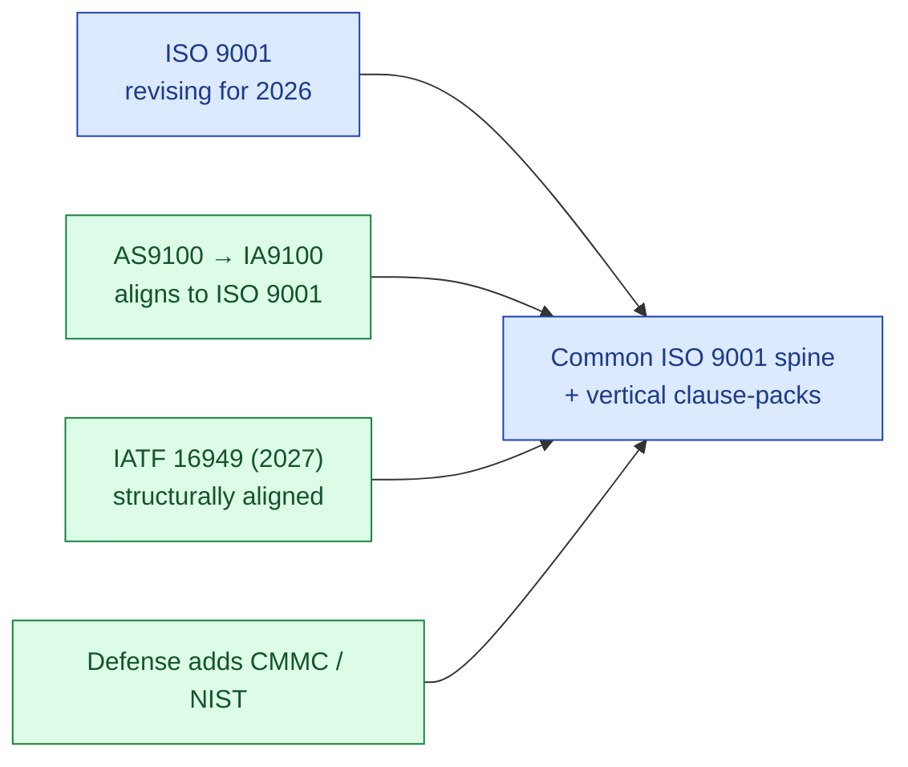
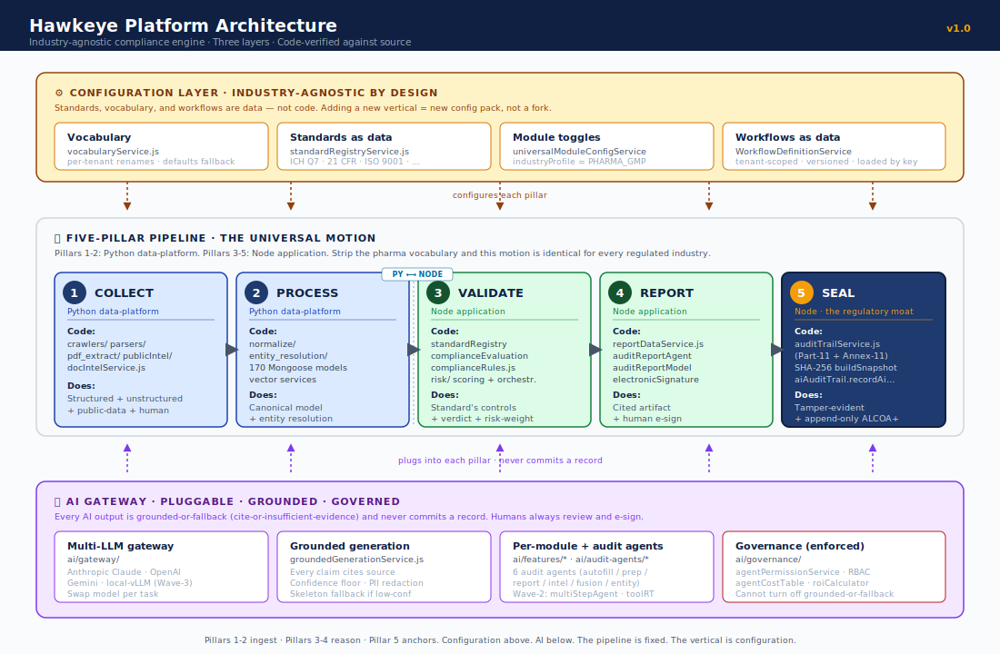
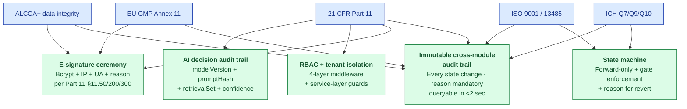
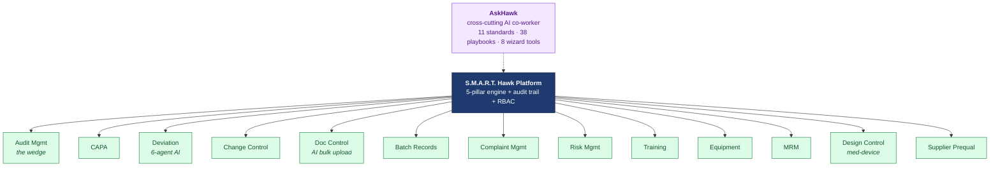
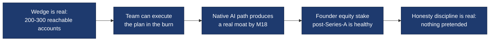

# The S.M.A.R.T. Hawk Story

| Field | Value |
|---|---|
| Audience | Investor · CTO · QA Head · Regulator (pick your track in §0) |
| Status | v1.0 |
| Length | 12 pages · ~15 min read |
| Last updated | 2026-05-31 |

> 💡 **What this document is.** The single canonical narrative for S.M.A.R.T. Hawk. Everything else in `Doc_V2/` is reference material that supports this story. Read this first.

---

## 0. Pick your track

This story has one spine but four reading paths. Each track is ~5 minutes.

| Audience | Read | Skip |
|---|---|---|
| 🪙 **Investor** | §1 Problem · §2 Market · §3 Vision · §6 Traction · §7 Ask | §4-§5 (architecture detail) |
| 🛠 **CTO / Engineer** | §1 Problem · §3 Vision · §4 Architecture · §5 Modules | §2 Market · §7 Ask |
| 📦 **QA Head** | §1 Problem · §5 Modules (audit deep) · §6 Traction | §2 Market · §4 Architecture |
| 🔍 **Regulator** | §1 Problem · §4 Architecture (compliance) · §5 Modules (audit) | §2 Market · §7 Ask |

---

## 1. The Problem

### 1a. The picture today

> *Asha Sharma is QA Head at a mid-size CDMO in Pune. This week alone, three new audit-prep requests landed in her inbox. The audit team at Cipla wants a 47-page Pre-Audit Questionnaire by Friday. Lupin's auditor needs supporting documents from her 2024 batch records. A third-party WHO-PQ assessor is asking the same questions in a different format.*
>
> *Asha has 5 people on her team. They will spend the next 12 working days on these three audits — including the supplier-side response, the on-site visit, and the CAPA cycle that always follows. Her calendar for the rest of the quarter holds 8 more audits like these.*

This is normal. Asha hosts **30+ audits per year**, mostly redundant, mostly painful, all forced.

### 1b. The pattern at scale

*The cost of doing audit + supplier quality the way the industry does today.*

### 1c. What it costs (real numbers, one customer)

A Tier-3 CDMO (3 sites, 5 QA staff, 30 audits/year):

| Cost line | ₹/year | $/year |
|---|---|---|
| Audit preparation time (5 QA × 30 audits × 4 days × ₹10K/day) | ₹60L | $72K |
| Audit response + CAPA tracking (manual) | ₹18L | $22K |
| External audit-prep consultants | ₹6-15L | $7-18K |
| Cost of audit findings + remediation (1 critical/yr typical) | ₹5-25L | $6-30K |
| **TOTAL annual quality cost** | **~₹95L** | **~$115K** |

This is what every pharma in India is paying — and what every CDMO is bleeding away on operations that don't make their product better.

---

## 2. Why the Market Hasn't Fixed This

### 2a. The white space — who serves whom

### 2b. The 4 categories of incumbent — and what each cedes

| Incumbent type | Examples | What they own | What they cede |
|---|---|---|---|
| **Pharma EQMS premium** | Veeva, MasterControl, ComplianceQuest | Tier-1 pharma; deep validation packages; enterprise references | Anything under $30K/yr ACV; reproducible AI; cross-vertical buyers |
| **Vertical specialists** | Greenlight Guru (med-device), TraceGains (food) | Industry-specific artifacts (FAI, FSSC, PPAP) | Cross-industry primitive; supplier-audit network |
| **Audit-network plays** | Qualifyze | Live supplier-audit network in pharma | Internal EQMS workflow; reproducible AI |
| **Horizontal platforms** | ServiceNow, SAP, Salesforce | Distribution; ecosystem | Regulated-domain depth; GxP credibility; AI grounded in standards |

### 2c. The six white spaces (the wedge)

1. **SMB / emerging-market pharma** — Veeva's $30K floor leaves ~900-1,400 reachable Tier-2/3 accounts in India alone untouched
2. **Reproducible AI** — every incumbent retrofitting LLMs into legacy stacks; none ship cited + confidence-scored + audit-trailed AI
3. **Supplier audit as a workflow** (not a network) — Qualifyze owns the network; nobody owns the internal supplier-quality workflow at affordable pricing
4. **Cross-industry compliance primitive** — ServiceNow could build it but won't (no domain depth); Veeva could build it but won't (vertical depth IS their moat)
5. **Inspector-readiness as a product feature** — cross-module audit trail in <2 sec for any regulator question
6. **AI that compounds with usage** — active-learning loop from user disposition (accepted / edited / rejected) on every AI draft

### 2d. Why "horizontal compliance platform" is a trap (and we're not it)

> 🚫 **Naming the trap.** "Horizontal platform" is the most dangerous phrase in enterprise software. The graveyard is full of horizontal compliance platforms that lost to a focused vertical specialist in every single vertical, because regulated buyers want depth, references, and validation specific to their industry. **"We do everything" reads as "best at nothing."**

What we are instead: a **regulated-supply-chain compliance engine** that wins one vertical at a time. Pharma first (the beachhead). Food + cosmetics + med-device next (the adjacent ring). Auto + aero later (when standards convergence makes them cheap to enter).

The architecture happens to be industry-agnostic. The strategy is **sequenced verticalization** — never horizontal-from-day-one.

---

## 3. The Vision

### 3a. Mission

> 💡 Make regulated-industry compliance reproducible, defensible, and affordable — so quality teams spend their day improving products, not chasing paper.

### 3b. Vision

> 💡 A single industry-agnostic compliance engine that powers every regulated supply chain — pharma today, food + med-device tomorrow, every standards-governed industry in time — earned one vertical at a time.

### 3c. The macro tailwind we're rowing with

*Standards bodies are deliberately converging on a common ISO 9001 spine with vertical clause-packs on top. That is precisely the engine-plus-config architecture S.M.A.R.T. Hawk already has. We're rowing with this current, not against it.*

### 3d. The reframe that makes this coherent

S.M.A.R.T. Hawk is:
- **Not a pharma tool** (though that's our beachhead)
- **Not a horizontal platform** (the trap)
- **Not Veeva-cheaper** (different game)

S.M.A.R.T. Hawk is the **regulated-supply-chain compliance engine** whose architecture is industry-agnostic, deployed beachhead-first and expanded ring by ring.

Competition redefined:
- Not Veeva (different game)
- The vertical specialist in each new market we enter (Greenlight Guru in med-device, etc.)
- The horizontal platforms that could claim the cross-industry primitive but lack regulated-domain depth + reproducible AI

---

## 4. The Architecture

### 4a. The architecture (three layers, code-verified)

S.M.A.R.T. Hawk is not just a five-pillar pipeline — it's a **three-layer architecture** that makes the pipeline genuinely industry-agnostic by design. Every box is traced to actual files in the codebase.

### 4b. Two honesty callouts the code forces

> ⚠️ **Pillar 5 is tamper-evident, NOT blockchain.** Per-record SHA-256 hashing + append-only ALCOA+ trail. There is no chained ledger / no proof-of-work / no distributed consensus in the code. "Immutable record" in the honest sense means tamper-evident + append-only. We say so to regulators and to investors. Don't call it blockchain.

> ⚠️ **The pharma plug-in is the only fully-shipped vertical pack today.** The engine is industry-agnostic by construction (industryProfile defaults to `PHARMA_GMP`), but the standards library shipped is pharma. Food/cosmetics/med-device/auto/aerospace are configuration slots awaiting their packs. We say "industry-agnostic engine, pharma plug-in proven, ring-by-ring outward" — never "horizontal platform shipped."

### 4c. Two governance guarantees built into the AI layer

These cannot be configured away:

| Guarantee | What it means | Where it lives |
|---|---|---|
| **Grounded-or-fallback** | Every AI output cites a source, or returns "insufficient evidence." Never asserts what it cannot cite. | `groundedGenerationService.js` |
| **Human-in-the-loop for record commit** | AI drafts; AI suggests; AI scores. AI never commits a record. A human always reviews and e-signs. | `requireESignature` middleware + per-module workflow services |

Admin controls tune AI behavior within these guarantees; they cannot remove them.

### 4b. The platform stack (1 paragraph for execs; deep dive in `04-engineering/`)

Frontend: Next.js 15 App Router · React 19 · MUI 6 · TypeScript
API: Node.js 20 · Express · 4-layer middleware chain (auth → tenant → RBAC → e-sig)
Data: MongoDB Atlas · 128+ Mongoose models · multi-tenant via tenant scope
AI: Multi-LLM gateway (Claude / GPT-4 / Gemini) · grounded generation service · 8 wizard tools · 6+ wave-2 AI agents
Audit trail: Immutable cross-module log · Part 11 / Annex 11 compliant · queryable in <2 sec

For depth, see:
- 1-page CEO view → [04-engineering/00-overview/PLATFORM-EXECUTIVE.md](04-engineering/00-overview/PLATFORM-EXECUTIVE.md)
- 1-page CTO view → [04-engineering/00-overview/PLATFORM-ENGINEERING.md](04-engineering/00-overview/PLATFORM-ENGINEERING.md)
- Per-persona walkthrough → [04-engineering/00-overview/PLATFORM-USER-FLOWS.md](04-engineering/00-overview/PLATFORM-USER-FLOWS.md)
- Full reference → [04-engineering/00-overview/PLATFORM-OVERVIEW.md](04-engineering/00-overview/PLATFORM-OVERVIEW.md)

### 4c. The compliance spine (why a regulator trusts this)

*One implementation, many regulators satisfied. This is the architectural payoff of unified controls. A regulator can ask "what changed, when, by whom, why, with what evidence" and get an answer in <2 sec.*

---

## 5. The Modules — Pharma Today, More Tomorrow

### 5a. What's live (15 default modules + cross-cutting AI)

*Every module sits on the same five-pillar engine. AskHawk is the cross-cutting AI co-worker that surfaces regulations, SOPs, and "do this for me" workflows in every module's context.*

### 5b. How modules interlock (the chain of evidence)

A real-world cascade from a single regulator finding — same record carries through 7 modules in 4-6 weeks:

### 5c. The wedge (Audit Management) — why we land here first

| Why Audit | Evidence |
|---|---|
| **Acute pain** | 30+ audits/year per CDMO; ~₹95L annual quality cost |
| **Single decision-maker** | QA Head can buy without IT or board approval |
| **Highest incumbent gap** | Veeva is too expensive; Qualifyze is network-only; nobody owns affordable workflow |
| **Travels across every vertical** | Supplier audit exists in pharma, food, auto, aero, electronics, chemicals |
| **Fast time-to-value** | 60-day PoC on 1-2 real audits; pricing pays for itself in <4 months |

Audit lands → expand to CAPA/Deviation/Change/Doc within 6 months. **Land-and-expand built into the architecture.**

For the audit deep-dive (storybook with 4 audience cuts): [06-modules/audit-management/STORYBOOK.md](06-modules/audit-management/STORYBOOK.md)

---

## 6. The Traction

### 6a. What's shipped

> ✅ **Built (as of May 2026):**
> - Full 13-module EQMS suite + AskHawk cross-cutting AI
> - Part 11 / Annex 11–grade audit trail + e-signature across every regulated action
> - 3-phase AskHawk arc shipped May 1-30 (Regulations Q&A + SOPs + App Wizard with 8 tools)
> - 6-agent AI stack on Deviation module (intake / similarity / disposition / CAPA recommend / trend / 5-Why)
> - Document Control AI bulk upload + classification wizard
> - Audit module observation drafter + auditor coach + report assembler
> - Multi-LLM gateway (Anthropic + OpenAI + Gemini) with grounded gen + skeleton fallback
> - Cross-module audit trail browser

### 6b. What's pre-customer (the honest part)

> ⚠️ **Not yet:**
> - Paid customers (LOIs in discovery with 2 design partners — Sanpras + Novex)
> - SOC 2 Type 1 (target M12)
> - Validation packages per-tenant (template exists; tenant-specific delivery starts at first customer)
> - S.M.A.R.T. Hawk-tuned Llama-3 in production (planned M12)
> - Cross-tenant supplier intel UI (URS-B-006; deferred)
> - 7 other URS open questions across modules

### 6c. Why this still works (what investors need to believe)

1. The wedge is real — 900-1,400 reachable Tier-2/3 pharma accounts in India alone
2. The team can execute the plan (India-cost team, founders with deep pharma + tech)
3. The native AI path produces a real moat by M18 (grounded + reproducible + fine-tuned)
4. Founders' equity post-Series-A is healthy (~47% combined; ~23.5% each)
5. The honesty discipline is real (this whole document tells you what's NOT yet validated)

---

## 7. The Ask

### 7a. Where we are (M0)

| Metric | Value |
|---|---|
| Founders | 2 (50/50) |
| Team | 2 + 2 advisors (PT) |
| Customers | 0 paying; 2 design partners |
| ARR | $0 |
| Burn | $0 (bootstrapped to date) |
| Cash | Pre-funding |

### 7b. The angel round

| Field | Value |
|---|---|
| **Raise** | $1.2-1.5M (target $1.5M) |
| **Pre-money** | ~$5.5M |
| **Post-money** | ~$7M |
| **Use of funds** | 65% team build · 10% AI infra · 10% compliance/SOC 2 · 8% GTM · 7% buffer/ops |
| **Runway** | 18 months |
| **Milestones at close** | 25-35 paying customers · $250-400K ARR · S.M.A.R.T. Hawk-tuned AI in production · 1+ ring-1 customer signed |

> ⚠️ **Note for the deck.** The current `pitch-deck.pdf` says $3M. **The plan revised to $1.5M based on bottom-up India-cost-team analysis.** Re-render before sending externally.

### 7c. The two rounds after

| Round | Target | Size | Trigger |
|---|---|---|---|
| **Seed** | Q4 2027 (M18) | $3-5M | $250-400K ARR + 25-35 customers + 1 reference deployment |
| **Series A** | Q3 2028 (M30-36) | $10-15M | $1.0-1.5M ARR + 100-150 customers + multi-vertical proof + 110%+ NDR |

### 7d. What the angel needs to believe

---

## 8. The Next Pages — Where to Go From Here

After this story:

| If you want | Open |
|---|---|
| **More on strategy** | [01-strategy/](01-strategy/) — VISION + MARKET + GTM + PRICING + PARTNERSHIPS |
| **The actual business plan** | [02-fundraising/business-plan/BUSINESS-PLAN.md](02-fundraising/business-plan/BUSINESS-PLAN.md) — bottom-up financials |
| **Architecture (executive)** | [04-engineering/00-overview/PLATFORM-EXECUTIVE.md](04-engineering/00-overview/PLATFORM-EXECUTIVE.md) — 1 page |
| **Architecture (engineering)** | [04-engineering/00-overview/PLATFORM-ENGINEERING.md](04-engineering/00-overview/PLATFORM-ENGINEERING.md) — 1 page |
| **Architecture (user)** | [04-engineering/00-overview/PLATFORM-USER-FLOWS.md](04-engineering/00-overview/PLATFORM-USER-FLOWS.md) — per persona |
| **Audit module deep dive** | [06-modules/audit-management/STORYBOOK.md](06-modules/audit-management/STORYBOOK.md) — 4 audience cuts |
| **AI architecture deep dive** | [04-engineering/07-ai/AI-ARCHITECTURE.md](04-engineering/07-ai/AI-ARCHITECTURE.md) |
| **Regulatory compliance** | [08-compliance-regulatory/](08-compliance-regulatory/) — Part 11 / ICH / EU GMP / ISO 9001 |
| **All other modules** | [06-modules/](06-modules/) — 14 module specs |

---

## Honest Reckoning

> ⚠️ **What this document does NOT pretend.** We are pre-customer. The TAM is bottom-up, not headline. The pitch deck still asks $3M while the business plan revises to $1.5M (we say so in §7b). AskHawk shipped a 3-phase arc that is documented in code but not in every spec (DOCS-DRIFT banners flag the gap). The audit module has 7 known engineering gaps tracked in URS open questions. The Marketplace module is plan-stage, not built. The first non-pharma vertical is M24+ aspiration, not active development. **All of this is in the docs — not hidden.**
>
> This is the operating discipline of being a startup that says hard things out loud. Investors who want polished-pretend should skip us. Investors who want truth-with-conviction should keep reading.

---

*S.M.A.R.T. Hawk · Doc_V2 · The Story · 2026-05-31*
